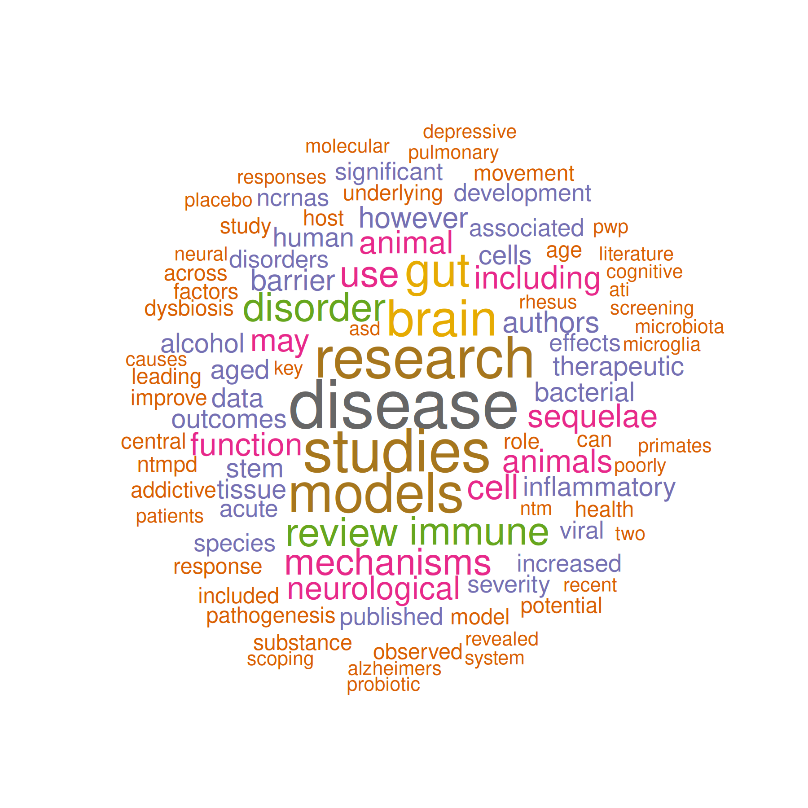

# Finding Journals for Your Paper

JournalAnalysis matches Europe PMC articles to journal-level metrics
from Scimago or InCites (JCR). This tutorial walks through a typical
workflow: define a search, retrieve and inspect results, summarize
abstracts, rank journals, and export a shortlist.

## Setup

Load JournalAnalysis and dplyr for the filtering steps later in the
tutorial.

``` r

library(JournalAnalysis)
library(dplyr)
```

## Define your search

Europe PMC queries use the same boolean syntax as the website search
box. You can pass one query or combine several; multiple queries are
unioned before filtering.

JournalAnalysis also ships example query strings you can adapt:

``` r

query3
#> [1] "microbiome AND (psychiatry OR psychology OR neuroscience) AND (rhesus OR macaque or human or stress or monkey) AND (NOT ecology)"
```

For this tutorial we use `query3`, which targets microbiome papers in
psychiatry, psychology, and neuroscience-related contexts while
excluding ecology papers.

See the [Europe PMC search
help](https://europepmc.org/Help#whatserachingEPMC) for field names and
operators.

## Retrieve publication data

[`get_publication_data()`](https://vallenderlab.github.io/journalanalysis/reference/get_publication_data.md)
is the main entry point. It:

1.  Loads journal metrics from `scimago` or `incities` (InCites / JCR)
2.  Queries Europe PMC for each search string
3.  Filters articles by year and citation count
4.  Joins articles to journals by ISSN

Start with a modest `limit` while you refine the query:

``` r

pub_data <- get_publication_data(
  journal_source = "scimago",
  queries = query3,
  limit = 200,
  min_year = 2015,
  min_citations = 3,
  n_cores = 1
)
#> 28942 records found, returning 200
#> Removed records published before 2015.
#> Removed records with less than 3 citations.
#> Removed records with NA values for pmid, doi, and authors.
#> 17 records passed the filter.

length(pub_data)
#> [1] 3
names(pub_data)
#> [1] "journals" "articles" "combined"
vapply(pub_data, nrow, integer(1))
#> journals articles combined 
#>       16       17       17
```

The returned list has three elements:

| Element             | Description                         |
|---------------------|-------------------------------------|
| `pub_data$articles` | Article metadata from Europe PMC    |
| `pub_data$journals` | Journal metrics for matched ISSNs   |
| `pub_data$combined` | Articles joined to journal metadata |

## Inspect the results

After retrieval, inspect each list element to confirm the query and
filters behaved as expected.

``` r

dplyr::glimpse(pub_data$articles)
#> Rows: 17
#> Columns: 30
#> $ id                    <chr> "41077197", "40420360", "40558535", "41092898", …
#> $ source                <chr> "MED", "MED", "MED", "MED", "MED", "MED", "MED",…
#> $ pmid                  <chr> "41077197", "40420360", "40558535", "41092898", …
#> $ pmcid                 <chr> "PMC12666862", "PMC12106051", "PMC12190894", "PM…
#> $ doi                   <chr> "10.1016/j.jinf.2025.106626", "10.1002/alz.70273…
#> $ title                 <chr> "Age-related severity of nontuberculous mycobact…
#> $ authorString          <chr> "Napier EG, Doratt BM, Cinco IR, Stuart EV, Gero…
#> $ journalTitle          <chr> "J Infect", "Alzheimers Dement", "Cells", "Neuro…
#> $ issue                 <chr> "5", "5", "12", "24", "1", "5", "12", NA, NA, "1…
#> $ journalVolume         <chr> "91", "21", "14", "113", "30", "17", "10", "19",…
#> $ pubYear               <int> 2025, 2025, 2025, 2025, 2025, 2025, 2024, 2025, …
#> $ journalIssn           <chr> "01634453; 15322742;", "15525260; 15525279;", "2…
#> $ pageInfo              <chr> "106626", "e70273", "908", "4107-4133", "226", "…
#> $ pubType               <chr> "research-article; journal article", "review-art…
#> $ isOpenAccess          <chr> "Y", "Y", "Y", "N", "Y", "Y", "Y", "Y", "Y", "Y"…
#> $ inEPMC                <chr> "Y", "Y", "Y", "Y", "Y", "Y", "Y", "Y", "Y", "Y"…
#> $ inPMC                 <chr> "Y", "Y", "Y", "Y", "Y", "Y", "Y", "Y", "Y", "Y"…
#> $ hasPDF                <chr> "Y", "Y", "Y", "Y", "Y", "Y", "Y", "Y", "Y", "Y"…
#> $ hasBook               <chr> "N", "N", "N", "N", "N", "N", "N", "N", "N", "N"…
#> $ hasSuppl              <chr> "Y", "Y", "N", "N", "N", "N", "Y", "N", "Y", "Y"…
#> $ citedByCount          <dbl> 3, 10, 3, 8, 8, 3, 4, 7, 3, 3, 38, 10, 12, 4, 4,…
#> $ hasReferences         <chr> "Y", "Y", "Y", "Y", "Y", "Y", "Y", "Y", "Y", "Y"…
#> $ hasTextMinedTerms     <chr> "Y", "Y", "Y", "Y", "Y", "Y", "Y", "Y", "Y", "Y"…
#> $ hasDbCrossReferences  <chr> "N", "N", "N", "N", "N", "N", "N", "N", "N", "N"…
#> $ hasLabsLinks          <chr> "N", "Y", "Y", "Y", "Y", "Y", "Y", "Y", "Y", "Y"…
#> $ hasTMAccessionNumbers <chr> "Y", "N", "N", "N", "N", "N", "Y", "N", "N", "N"…
#> $ firstIndexDate        <chr> "2025-10-13", "2025-05-27", "2025-06-26", "2025-…
#> $ firstPublicationDate  <chr> "2025-10-10", "2025-05-01", "2025-06-16", "2025-…
#> $ ISSN.1                <chr> "01634453", "15525260", "20734409", "08966273", …
#> $ ISSN.2                <chr> "15322742;", "15525279;", "", "10974199;", "2047…
dplyr::glimpse(pub_data$journals)
#> Rows: 16
#> Columns: 28
#> $ Rank                      <int> 115, 306, 349, 501, 752, 800, 900, 1215, 144…
#> $ Sourceid                  <dbl> 17978, 19700182758, 3600148102, 50032, 21100…
#> $ Title                     <chr> "Neuron", "Nature Communications", "Alzheime…
#> $ Type                      <chr> "journal", "journal", "journal", "journal", …
#> $ Issn                      <chr> "10974199, 08966273", "20411723", "15525279,…
#> $ Publisher                 <chr> "Cell Press", "Nature Research", "John Wiley…
#> $ Open.Access               <chr> "No", "Yes", "No", "Yes", "No", "Yes", "No",…
#> $ Open.Access.Diamond       <chr> "No", "No", "No", "No", "No", "No", "No", "N…
#> $ SJR                       <dbl> 8.564, 4.904, 4.530, 3.685, 2.906, 2.827, 2.…
#> $ SJR.Best.Quartile         <chr> "Q1", "Q1", "Q1", "Q1", "Q1", "Q1", "Q1", "Q…
#> $ H.index                   <int> 569, 634, 194, 189, 124, 144, 247, 152, 193,…
#> $ Total.Docs...2025.        <int> 348, 11528, 1244, 300, 12, 538, 365, 289, 83…
#> $ Total.Docs...3years.      <int> 1058, 26313, 1938, 947, 28, 1598, 1033, 1072…
#> $ Total.Refs.               <int> 27520, 755955, 72380, 24581, 1953, 30815, 14…
#> $ Total.Citations..3years.  <int> 12733, 452297, 17963, 12017, 277, 10831, 542…
#> $ Citable.Docs...3years.    <int> 778, 25888, 1394, 946, 25, 1593, 700, 394, 2…
#> $ Citations...Doc...2years. <dbl> 11.25, 16.60, 11.93, 11.19, 7.86, 6.38, 5.10…
#> $ Ref....Doc.               <dbl> 79.08, 65.58, 58.18, 81.94, 162.75, 57.28, 3…
#> $ X.Female                  <dbl> 41.08, 37.59, 49.88, 47.54, 75.56, 43.29, 46…
#> $ Overton                   <int> 2, 91, 6, 1, 0, 0, 0, 7, 6, 0, 1, 0, 6, 0, 0…
#> $ Country                   <chr> "United States", "United Kingdom", "United S…
#> $ Region                    <chr> "Northern America", "Western Europe", "North…
#> $ Coverage                  <chr> "1988-2026", "2010-2026", "2005-2026", "2004…
#> $ Categories                <chr> "Neuroscience (miscellaneous) (Q1)", "Bioche…
#> $ Areas                     <chr> "Neuroscience", "Biochemistry, Genetics and …
#> $ ISSN                      <chr> "10974199; 08966273", "20411723", "15525279;…
#> $ ISSN.1                    <chr> "10974199", "20411723", "15525279", "1742209…
#> $ ISSN.2                    <chr> "08966273", "", "15525260", "", "21683492", …
dplyr::glimpse(pub_data$combined)
#> Rows: 17
#> Columns: 55
#> $ id                        <chr> "41077197", "40420360", "40558535", "4109289…
#> $ source                    <chr> "MED", "MED", "MED", "MED", "MED", "MED", "M…
#> $ pmid                      <chr> "41077197", "40420360", "40558535", "4109289…
#> $ pmcid                     <chr> "PMC12666862", "PMC12106051", "PMC12190894",…
#> $ doi                       <chr> "10.1016/j.jinf.2025.106626", "10.1002/alz.7…
#> $ title                     <chr> "Age-related severity of nontuberculous myco…
#> $ authorString              <chr> "Napier EG, Doratt BM, Cinco IR, Stuart EV, …
#> $ journalTitle              <chr> "J Infect", "Alzheimers Dement", "Cells", "N…
#> $ issue                     <chr> "5", "5", "12", "24", "1", "5", "12", NA, NA…
#> $ journalVolume             <chr> "91", "21", "14", "113", "30", "17", "10", "…
#> $ pubYear                   <int> 2025, 2025, 2025, 2025, 2025, 2025, 2024, 20…
#> $ journalIssn               <chr> "01634453; 15322742;", "15525260; 15525279;"…
#> $ pageInfo                  <chr> "106626", "e70273", "908", "4107-4133", "226…
#> $ pubType                   <chr> "research-article; journal article", "review…
#> $ isOpenAccess              <chr> "Y", "Y", "Y", "N", "Y", "Y", "Y", "Y", "Y",…
#> $ inEPMC                    <chr> "Y", "Y", "Y", "Y", "Y", "Y", "Y", "Y", "Y",…
#> $ inPMC                     <chr> "Y", "Y", "Y", "Y", "Y", "Y", "Y", "Y", "Y",…
#> $ hasPDF                    <chr> "Y", "Y", "Y", "Y", "Y", "Y", "Y", "Y", "Y",…
#> $ hasBook                   <chr> "N", "N", "N", "N", "N", "N", "N", "N", "N",…
#> $ hasSuppl                  <chr> "Y", "Y", "N", "N", "N", "N", "Y", "N", "Y",…
#> $ citedByCount              <dbl> 3, 10, 3, 8, 8, 3, 4, 7, 3, 3, 38, 10, 12, 4…
#> $ hasReferences             <chr> "Y", "Y", "Y", "Y", "Y", "Y", "Y", "Y", "Y",…
#> $ hasTextMinedTerms         <chr> "Y", "Y", "Y", "Y", "Y", "Y", "Y", "Y", "Y",…
#> $ hasDbCrossReferences      <chr> "N", "N", "N", "N", "N", "N", "N", "N", "N",…
#> $ hasLabsLinks              <chr> "N", "Y", "Y", "Y", "Y", "Y", "Y", "Y", "Y",…
#> $ hasTMAccessionNumbers     <chr> "Y", "N", "N", "N", "N", "N", "Y", "N", "N",…
#> $ firstIndexDate            <chr> "2025-10-13", "2025-05-27", "2025-06-26", "2…
#> $ firstPublicationDate      <chr> "2025-10-10", "2025-05-01", "2025-06-16", "2…
#> $ ISSN.1                    <chr> "01634453", "15525260", "20734409", "0896627…
#> $ ISSN.2                    <chr> "15322742;", "15525279;", "", "10974199;", "…
#> $ Rank                      <int> 1215, 349, 1977, 115, 31880, 6244, 2223, 266…
#> $ Sourceid                  <dbl> 22428, 3600148102, 21100978391, 17978, 13221…
#> $ Title                     <chr> "Journal of Infection", "Alzheimer's and Dem…
#> $ Type                      <chr> "journal", "journal", "journal", "journal", …
#> $ Issn                      <chr> "01634453, 15322742", "15525279, 15525260", …
#> $ Publisher                 <chr> "W.B. Saunders Ltd", "John Wiley and Sons In…
#> $ Open.Access               <chr> "Yes", "No", "Yes", "No", "Yes", "Yes", "Yes…
#> $ Open.Access.Diamond       <chr> "No", "No", "No", "No", "No", "No", "No", "N…
#> $ SJR                       <dbl> 2.180, 4.530, 1.687, 8.564, NA, 0.856, 1.575…
#> $ SJR.Best.Quartile         <chr> "Q1", "Q1", "Q1", "Q1", "-", "Q2", "Q1", "Q2…
#> $ H.index                   <int> 152, 194, 196, 569, 78, 33, 62, 152, 115, 19…
#> $ Total.Docs...2025.        <int> 289, 1244, 2022, 348, 174, 205, 251, 245, 14…
#> $ Total.Docs...3years.      <int> 1072, 1938, 9075, 1058, 1543, 310, 579, 1625…
#> $ Total.Refs.               <int> 10607, 72380, 189277, 27520, 0, 12013, 16063…
#> $ Total.Citations..3years.  <int> 3945, 17963, 58352, 12733, 7128, 1050, 2788,…
#> $ Citable.Docs...3years.    <int> 394, 1394, 8892, 778, 1534, 305, 576, 1459, …
#> $ Citations...Doc...2years. <dbl> 4.41, 11.93, 6.13, 11.25, 4.74, 3.50, 4.24, …
#> $ Ref....Doc.               <dbl> 36.70, 58.18, 93.61, 79.08, 0.00, 58.60, 64.…
#> $ X.Female                  <dbl> 46.76, 49.88, 47.25, 41.08, 41.83, 45.26, 45…
#> $ Overton                   <int> 7, 6, 0, 2, 1, 0, 1, 0, 0, 0, 1, 91, 6, 0, 0…
#> $ Country                   <chr> "United Kingdom", "United States", "Switzerl…
#> $ Region                    <chr> "Western Europe", "Northern America", "Weste…
#> $ Coverage                  <chr> "1979-2026", "2005-2026", "2011-2026", "1988…
#> $ Categories                <chr> "Infectious Diseases (Q1); Microbiology (med…
#> $ Areas                     <chr> "Medicine", "Medicine; Neuroscience", "Bioch…
```

PubMed IDs for the matched articles:

``` r

pmids <- pub_data$articles$pmid
head(pmids)
#> [1] "41077197" "40420360" "40558535" "41092898" "40176069" "40423227"
```

## Summarize abstracts

[`get_word_cloud()`](https://vallenderlab.github.io/journalanalysis/reference/get_word_cloud.md)
fetches abstracts for a vector of PubMed IDs and writes a PNG word
cloud:

``` r

wordcloud_path <- "microbiome_psych_wordcloud.png"

get_word_cloud(
  pubmed_ids = pmids,
  plot_name = wordcloud_path
)
#> There are total 17 PMIDs
#> Warning in tm_map.SimpleCorpus(abstTxt, removePunctuation): transformation
#> drops documents
#> Warning in tm_map.SimpleCorpus(text2.corpus, function(x) removeNumbers(x)):
#> transformation drops documents
#> Warning in tm_map.SimpleCorpus(text2.corpus, tolower): transformation drops
#> documents
#> Warning in tm_map.SimpleCorpus(text2.corpus, removeWords,
#> stopwords("english")): transformation drops documents
#> agg_png 
#>       2

knitr::include_graphics(wordcloud_path)
```



## Rank journals

Filter the matched journals to subject areas of interest, then keep
titles at or above the median SJR within that subset.

``` r

cats <- "Multidisciplinary|Neuroscience|Psychology|Psychiatry"

best_journals <- pub_data$journals |>
  filter(
    Type == "journal",
    SJR >= median(SJR, na.rm = TRUE),
    grepl(cats, Categories)
  ) |>
  select(Title, Rank, Type, SJR, Country, Categories)

best_journals
#> # A tibble: 5 × 6
#>   Title                              Rank Type      SJR Country       Categories
#>   <chr>                             <int> <chr>   <dbl> <chr>         <chr>     
#> 1 Neuron                              115 journal  8.56 United States Neuroscie…
#> 2 Nature Communications               306 journal  4.90 United Kingd… Biochemis…
#> 3 Alzheimer's and Dementia            349 journal  4.53 United States Cellular …
#> 4 Journal of Neuroinflammation        501 journal  3.68 United Kingd… Cellular …
#> 5 Alcohol Research: Current Reviews   752 journal  2.91 United States Clinical …
```

Adjust the category pattern and ranking rule to match your field. For
InCites data (`journal_source = "incities"`, or aliases `incites` /
`jcr`), use columns such as `Journal.Impact.Factor` instead of `SJR`.

## Export results

Save the ranked journal table for review outside R.

``` r

export_path <- file.path(tempdir(), "highest_impact_relevant_journals")
save_as_csv(best_journals, filename = export_path)
list.files(tempdir(), pattern = "highest_impact_relevant_journals", full.names = TRUE)
#> [1] "/tmp/RtmpocEeaR/highest_impact_relevant_journals.csv"
```

## Next steps

- Tighten or broaden the Europe PMC query and re-run
  [`get_publication_data()`](https://vallenderlab.github.io/journalanalysis/reference/get_publication_data.md)
- Compare `scimago` and `incities` (InCites / JCR) journal sources for
  your topic
- See
  [`?get_publication_data`](https://vallenderlab.github.io/journalanalysis/reference/get_publication_data.md)
  and the [function
  reference](https://vallenderlab.github.io/journalanalysis/reference/index.html)
  for all parameters
